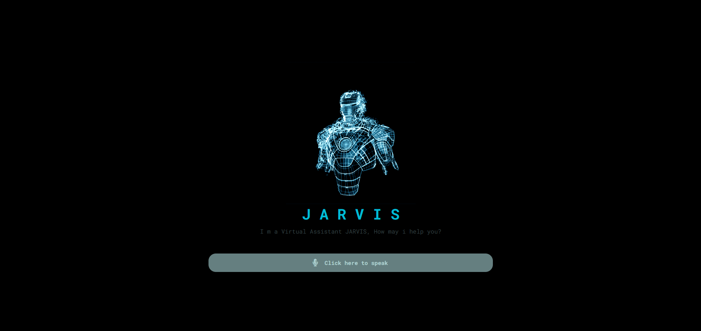

<h1 align="center">
  Jarvis
</h1>

 

  

## ✨ Tecnologias

Esse projeto foi desenvolvido com as seguintes tecnologias:

## 💻 Projeto

O Jarvis é um Assistente virtual capaz de executar diversas tarefas
